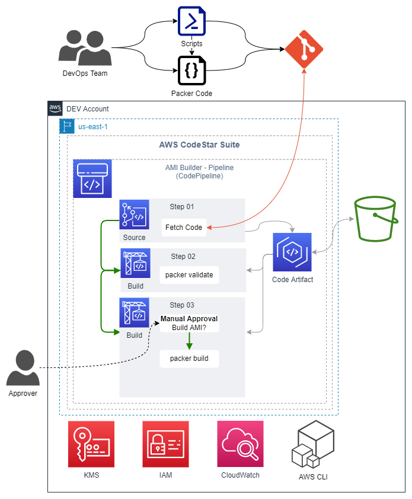

# AWS CodePipeline Project to deploy a Packer AMI Builder

Packer is a free and open source tool for creating golden images for multiple platforms from a single source configuration, in this project, we will create two EC2 AMI builders pipelines using AWS Codepipeline, one to build a Linux AMI and one to build a Windows AMI.

In this repository I only provide the terraforming code for the pipeline infrastructure, but we also need a separate repository with the packager code, which I also provide in the link below.

[ami-builder-codepipeline-packer-repo](https://github.com/JManzur/ami-builder-codepipeline-packer-repo)

#### Prerequisites

Create your own packer repo (you can clone or fork [mine](https://github.com/JManzur/ami-builder-codepipeline-packer-repo)), and configure the CodeStar connection [following this instructions](https://github.com/JManzur/ami-builder-codepipeline/blob/main/resources/CodeConnection.pdf).

## Resources deployed by this manifest:

- Artifact S3 Bucket
- KMS Key for the Artifact S3 Bucket
- IAM Role for the CodePipeline Project.
- IAM Role for the CodeBuild Project.
- CodeBuil Projects.
- CodePipeline Projects.

### Deployment diagram:



## Tested with: 

| Environment | Application | Version  |
| ----------------- |-----------|---------|
| WSL2 Ubuntu 20.04 | Terraform | v1.3.2  |

## Initialization How-To:

Located in the root directory, create a file called default.auto.tfvars with a content like the following:

```bash
aws_profile       = "default"
code_connection   = "arn:aws:codestar-connections:REGION:ACCOUNT_ID:connection/XXXXXXXXXXXXXXXXXXXXXXXXXXX"
repository_id     = "USER_NAME/REPO_NAME"
repository_branch = "main"
name_prefix       = "ami-builder"
aws_region        = "us-east-1"
```

Initialice the direcotry to download the necessary modules and start the backend.

```bash
terraform init
```

## Deployment How-To:
Located in the root directory, run the following command:

```bash
terraform apply
```

## Author:

- [@JManzur](https://jmanzur.com)

## Documentation:

- [EXAMPLE](URL)